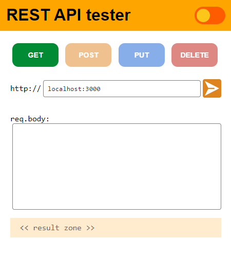
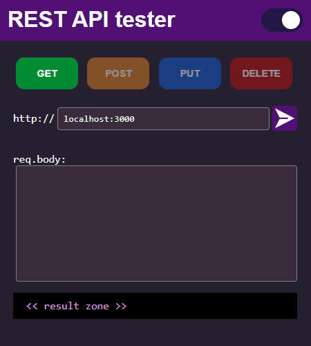

# apitest
Simple RESTful API verbs tester

Now with Light and Dark modes!



## How to Use
just open the ```index.html``` file, choose the verbs you want to try, add the URL and click **SEND**

## License
GPL-3.0

### Keywords
_"api", "test", "apitest", "rest", "restful", "html"_
